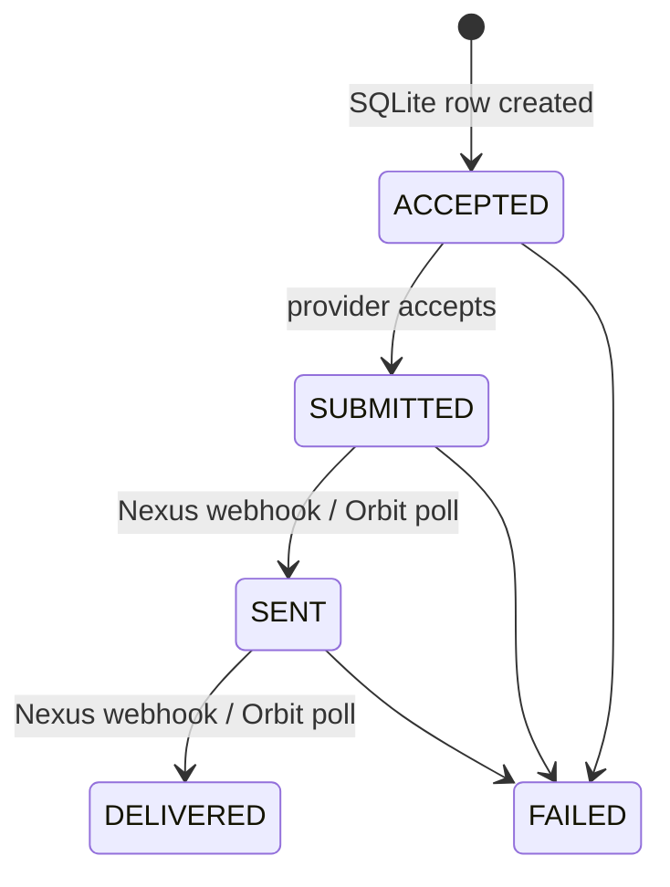

# Design note — Multi-Provider Messaging Gateway

## Routing table

| `sender_id` | Provider decision |
| --- | --- |
| `NEXUS01`, `NEXUS02` | NexusSMS |
| `ORBIT01` | OrbitMsg |
| `AUTO01` | NexusSMS, then OrbitMsg once only on Nexus 5xx/timeout |
| any other value | reject with HTTP 400 |

The table is a single configuration module (`src/config.js`). Request fields never select a provider, which prevents a caller from bypassing the sender policy.

## State machine and provider mapping

Terminal states are immutable. Repeated or out-of-order events are ignored by the monotonic transition guard. Providers may omit `SENT`, so a known `DELIVERED` event can advance a `SUBMITTED` message directly to `DELIVERED`.

| Provider raw status | Gateway status |
| --- | --- |
| `accepted`, `queued`, `submitted`, `processing` | `SUBMITTED` |
| `sent`, `in_transit` | `SENT` |
| `delivered`, `success` | `DELIVERED` |
| `failed`, `rejected`, `undeliverable`, `expired` | `FAILED` |

Nexus delivery comes from an HMAC-SHA256 authenticated webhook. Orbit delivery is read by the explicit poll endpoint or optional scheduled poller.

## Idempotency, race safety, and auditability

`messages.client_ref` is the SQLite primary key and each request stores a SHA-256 fingerprint of the immutable sending fields. Creation is protected by `BEGIN IMMEDIATE`: one request creates the `ACCEPTED` row; equivalent concurrent requests read it. Within this gateway process they await a shared dispatch promise, so only the creator performs the provider call. Changed content for the same reference is a `409` conflict.

Every provider attempt and state transition is persisted in `attempts` and `audits`. Structured JSON logs include `client_ref`; terminal submission failures write `last_error`. Nexus webhook receipts have a unique event key (provider event ID, or a body hash), so duplicate callbacks cannot mutate state or add a second delivery audit entry.

## Retry/failover decision

Nexus 429 is retried at most three times with exponential backoff and jitter. For `AUTO01`, only a Nexus 5xx or timeout opens exactly one Orbit attempt. A confirmed Nexus success never sends to Orbit; an exhausted 429 does not fail over.

The gateway persists the failed Nexus attempt and the failover decision before invoking Orbit, and sends provider idempotency keys derived from `client_ref`. In a real distributed system, a network timeout is inherently ambiguous: Nexus might have accepted the request after the client timed out. Absolute cross-provider exactly-once delivery requires a Nexus message-lookup/transactional outbox contract before failover. With the assignment's fake-provider contract (timeout means no accepted send), this implementation has one successful provider send; the audit trail makes the ambiguity visible for a production extension.
